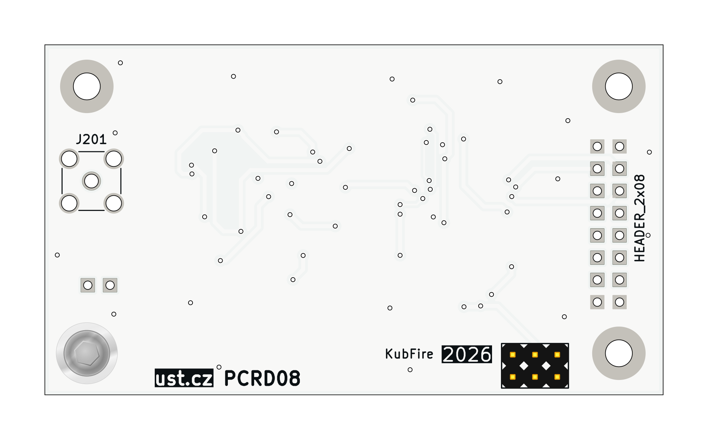
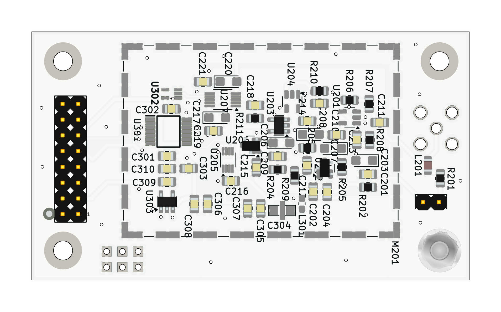

# PCRD08 - Analogue backend for SiPM detectors with scintillation crystals

Analogue front-end and ADC module for radiation detectors based on silicon photomultipliers (SiPM) coupled to scintillation crystals. The module amplifies the SiPM pulses, detects a threshold crossing, and digitizes the signal for a controlling MCU over SPI.

### Principle of function

The detector signal enters through the MCX connector J201 and is AC-coupled into a non-inverting amplifier (U201, AD8691). A second AD8691 stage (U204) provides additional gain before the signal reaches the LTC1865-MS ADC (U207), which is read out over SPI. A comparator (U203, TS3021ILT) together with a D flip-flop (U205, SN74LVC2G74) latches a digital flag whenever the signal crosses a threshold, which the controlling MCU can use to time the ADC conversion (CONV/RST/SCK/SDI/SDO are supplied by the host over the module's socket interface).

### Difference from PCRD07

PCRD08 reuses the general architecture of the older [PCRD07](https://github.com/mlab-modules/PCRD07) analogue backend (dual AD8691 gain stages, TS3021ILT comparator, LTC1865-MS ADC), but the analogue signal processing was reworked for SiPM+scintillator pulses, which are positive-going:

- **Input polarity** - PCRD07 (both revision A and B) amplifies the input signal with an inverting first stage (signal fed into the op-amp's `-` input, gain set by the feedback/input resistor ratio). PCRD08's input stage (U201) instead feeds the signal into the op-amp's `+` input, giving a non-inverting, unity-gain-at-high-frequency response suited to positive pulses.
- **No analogue sample-and-hold switch** - PCRD07 uses an analogue switch (TS5A4594) driven by its comparator/flip-flop pair to freeze the peak voltage on a storage capacitor, i.e. a true analogue peak-detector/memory circuit. PCRD08 has no such switch or hold capacitor; its comparator/flip-flop pair (U203/U205) only produces a digital threshold-crossing flag, and the ADC conversion is triggered directly by the host rather than sampling a held analogue voltage.

(Verified by comparing `hw/sch_pcb/analogue_backend.kicad_sch` of both modules.)
